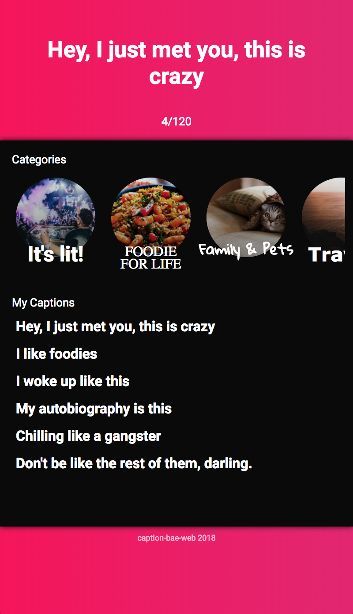

# caption-bae-web

CSS exercise of a Skeleton outline of a qoute generator. Inspired by Netflix's circle crop images.

**Feature Roadmap**
* Handle Multi-line todos
* User Login - Account based DB
* Multiple lists
* Web notifications
* Theming Options

## Getting Started

These instructions will get you a copy of the project up and running on your local machine for development and testing purposes. See running locally for notes on how to deploy the server locally on your machine. (Note: currently instructions are not 100% accurate)

### Prerequisites

1. [Git](https://git-scm.com/book/en/v2/Getting-Started-Installing-Git)
1. [Node](https://nodejs.org/en/)
1. Yarn: See [Yarn website for installation instructions](https://yarnpkg.com/lang/en/docs/install/)
1. A fork of the repo (for any contributions)
1. A clone of the [todo_api](https://github.com/KyruCabading/todo_api) on your local machine

### Installation

1. `cd caption_bae_web` to go into the project root
1. `yarn` to install the websites npm dependencies

### Running locally

1. `cd caption_bae_web` to go into the project root
1. `node app.js` to start the node server.
1. open http://localhost:8080 to open the site in your favorite browser

## Built With

* [express](https://expressjs.com/) - web application framework
* [node](https://nodejs.org/en/) - server framework

## Contributing

#### Create a branch

1. `git checkout master` from any folder in your local `caption-bae-web` repository
1. `git pull origin master` to ensure you have the latest main code
1. `git checkout -b the-name-of-my-branch` (replacing `the-name-of-my-branch` with a suitable name) to create a branch

## Authors

* **[KyruCabading](https://github.com/KyruCabading)** 
